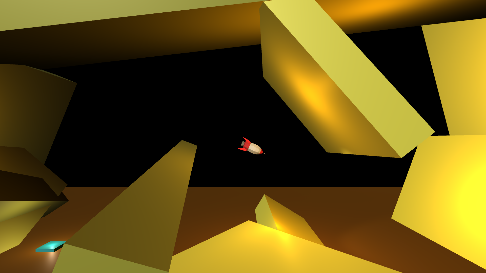

# Project Boost 0.1
This game is basically me following along a [this course](https://www.gamedev.tv/p/complete-c-unity-game-developer-3d-online-course-2020) that I got from Humble Bundle's [Stand with Ukraine bundle](https://www.reddit.com/r/Games/comments/tha0qc/comment/i17oba8) (no longer purchasable).

This repository is dedicated to the `Project Boost` section of the course.

## How to play
You can play the game through this [link](https://sharemygame.com/@BasOrAldi/project-boost-0-1).

A/D = rotate rocket left/right
Space = activate rocket thrusters

## Things to improve
I plan on continuing through the other sections of the course, but if I do decide to improve this project, I would to these:

### Quality of Life
- Main menu, this is important!
- More lighting, some places are too dim
### Aesthetics
- Stars on the sky, instead of pure black skybox
- Jagged background

### Features
- More levels
- Brakes?
- Checkpoint feature?
- Fuel?